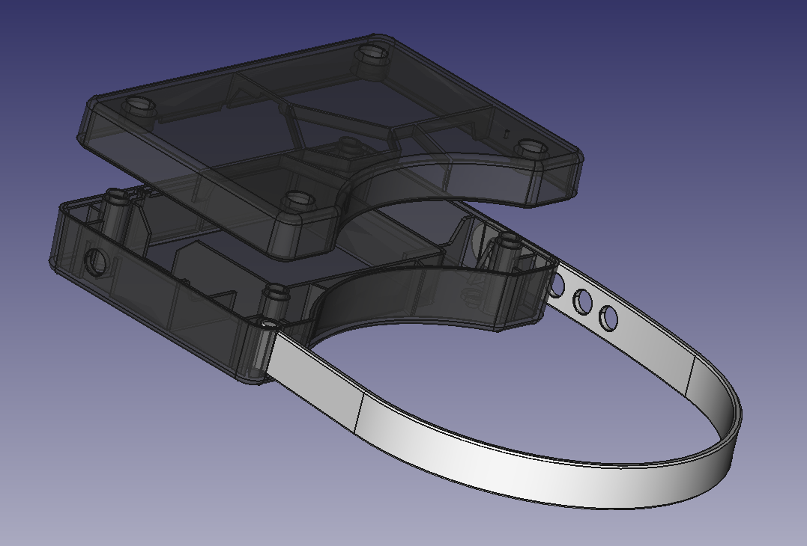

# Open-Source Water Meter Enclsoure Design

## Description

This repository contains the open-source CAD files for the YDrip water meter.

## License

This project is licensed under the CERN Open Hardware Licence Version 2 - Weakly Reciprocal. Please see the `LICENSE.txt` file for more details.